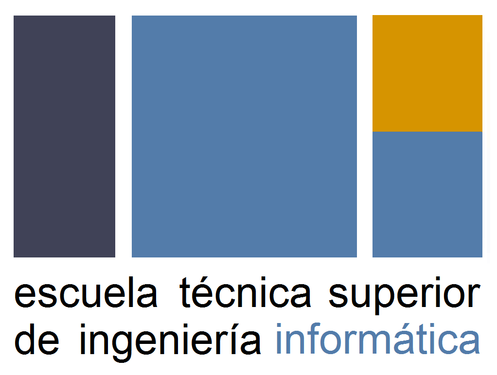

<h1 align="center">
   
  
   
  Chaotic Algorithms 
</h1>

<h4 align="center">A visual representation of some of the most famous chaotic algorithms.</h4>

  <a href="https://www.joseayllonllamas.com/chaotic-algorithms/graficas">Graphics</a> •
  <a href="https://www.joseayllonllamas.com/chaotic-algorithms/sistemasdinamicos">Dynamic Systems</a> •
  <a href="https://www.joseayllonllamas.com/chaotic-algorithms/mandelbrotmenu">Mandelbrot</a>  

   <b><a href="https://www.joseayllonllamas.com/chaotic-algorithms/">🔬 SEE FULL WEBSITE 🔬</a></b>
  

 

A Javascript project made specifically for my Computer Science degree back in 2017.

The target was to make a dynamic web project for visualization the different chaotic algorithms seen in my 4th-grade subject: Mathematics for computing.

 

    

 

Main features of the project:

-   Draw dynamic graphs.
-   Draw and increase in depth the Mandelbrot set.
-   Compare the time series graph with a defined dynamic function.
-   Represent the chaos through the Lyapunov exponent.
-   Step by step realization of the fractals: Karpinski carpet and triangle and Koch snowflake.
-   Draw the Feigenbaum diagram.
-   Dynamically get the Julià set associated with the Mandelbrot set.
-   Draw the Julià set.
-   Get the cobweb from a graph defined by the user.
-   Draw the Cantor set.

## Meta

Jose Antonio Ayllón Llamas

**Website**: [https://www.joseayllonllamas.com/](https://www.joseayllonllamas.com/)
 
**E-mail**: joseayllonllamas@hotmail.com
 
**Twitter**: [@joseaay](https://twitter.com/dbader_org)
 

## Contributing

1. Fork it (<https://github.com/Joseaay/chaotic-algorithms/fork>)
2. Create your feature branch (`git checkout -b feature/fooBar`)
3. Commit your changes (`git commit -am 'Add some fooBar'`)
4. Push to the branch (`git push origin feature/fooBar`)
5. Create a new Pull Request

 
 

[![License: GPL v3][license-image]][license-url]

<!-- Markdown link & img -->

[license-image]: https://img.shields.io/badge/License-GPLv3-blue.svg
[license-url]: https://www.gnu.org/licenses/gpl-3.0
